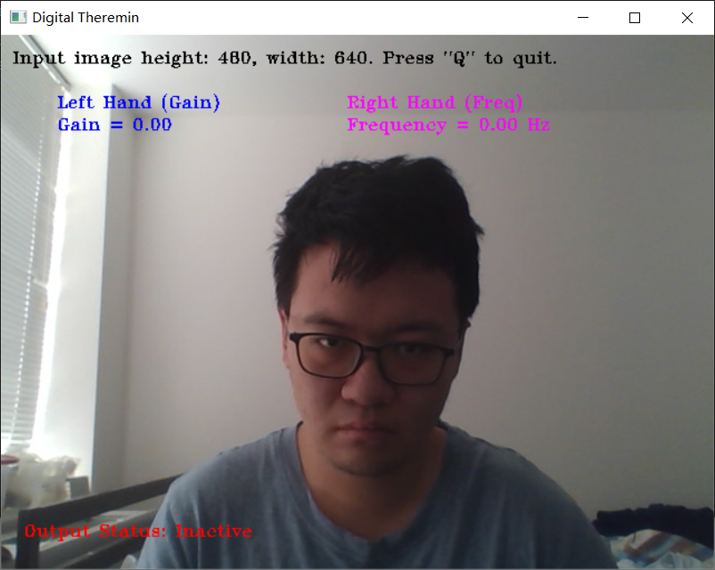
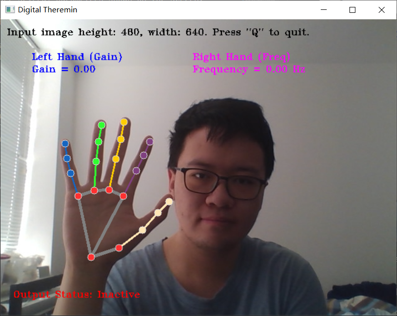

# Project Document

Group members: Zijie Liu (zl4284), Mingyang Gao (mg7170)

The topic of our project is a digital theremin.

## Packages

Packages used:

`mediapipe`: hand recognition

`cv2`: WebCam input processing and video output

`pyaudio`: audio output

## How to use

The main file is `Theremin Demo/main.py`. After running the python file, a window will appear, showing the input camera feed. There are several parameters shown on the screen:

The input image size, the parameters controlled by each hand, and the output status.

The program will only produce sound output when two hands are captured.

The `mediapipe` package can detect certain points on both hands and retrieve their relative positions on the screen. By obtaining these parameters, we can calculate the parameters we need to produce a sound.

Left hand can control the gain by moving it up and down in the screen. The gain is determined by its vertical position on the screen.

Right hand can control the frequency by opening and closing the fingers. the frequency is determined by the average distance between the tips of fingers.

Pressing button 'Q' can shut down the program.
