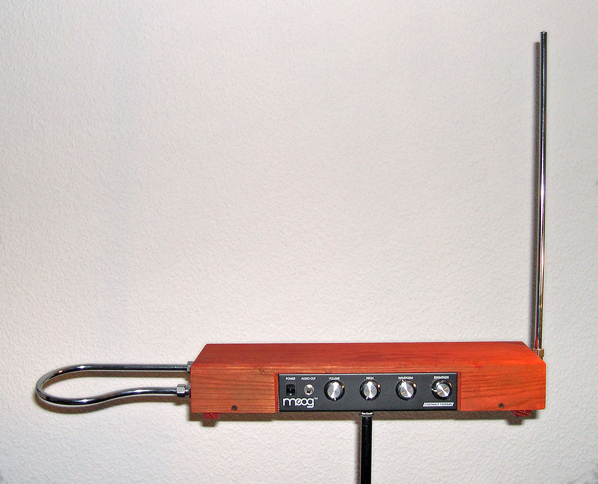

# Project 思路和随记

## 原理

根据我在网上查到的特雷门琴的原理，这个东西由主体部分和两个比较大的天线组成，见图。

下面的几个旋钮用来调节一些参数，咱们这里就不需要了，可能和sensitivity或者gain之类的有关。

特雷门琴演奏的关键在于这两个天线。摘自维基百科：“乐器包含有两个像天线的突出构造，一个是长直金属杆，一个是环状的水平金属圈，垂直杆控制音频率高低，水平环状圈控制音量大小。原理是利用手与天线构造的距离远近，改变其电容之大小，而影响其振荡回路之振荡频率。”

根据我在网上找的特雷门琴的演奏视频，感觉整个特雷门琴演奏不像别的乐器那样有章法，全靠演奏者自己感觉。既然这样，我认为咱们就可以自己设计一套演奏规律，能实现接近特雷门琴演奏原理的效果即可。

## 我设计的原理

既然原本特雷门琴的演奏原理是这样，那我可以设计识别两只手的姿态和位置来调节发声的frequency和gain，并且可以参考Tkinter的GUI那个demo来做发声和去除artifact。

实现这个过程需要到谷歌开发的mediapipe库，是我一个同学告诉我的，他21fall上了这门课，并且做了一个小的空气钢琴。这个库可以通过摄像头识别人脸、人体、手部等等对象。我从官方教程那里找了一个demo过来，在另外一个文件夹。需要安装mediapipe才能运行。那个demo可以识别手部位置，并且把识别到的一些关键点和骨架显示在屏幕上。

我设计的原理是：在摄像头视场范围内选取两个方形区域，分别识别左右手。其中左手用来控制gain（环状水平金属圈），右手用来控制frequency（长直金属杆）。因为识别手部的时候可以识别到手掌的关键点和每根手指的关键点（详见demo），我认为可以通过识别两只手不同部位的关键点来进行控制：

1. 左手：控制音量，识别手掌的关键点，位置取平均得到一个中心点$C_g$，根据点$C_g$在划分出来对应范围内的相对位置，在一定范围内调节gain。

    大致效果：左手抬高（因为是识别的手掌，所以关键在于抬高手掌，可以伸直手增加判断灵敏度）音量增加；左手降低音量变小。

2. 右手：控制频率，识别五根手指（或者除大拇指外的四根）的最远端关键点，位置取平均得到中心点$C_f$，计算这个点到几个关键点的距离并取平均，获得中心点到几个采样点的平均距离，用这个做权重计算频率。（或者也可以直接五个顶点两两取距离做平均值）

    大致效果：右手手指张得越开（因为计算的是手指尖之间的距离），频率越高；反之越低。

## 另外想实现的功能

1. 在屏幕上显示识别的区域（两个矩形）

2. 在矩形区域显示对应参数的数值（freq、gain）

3. 也许可以显示这个区域内获取的关键点的位置（坐标）

4. 在任意一个区域没有识别到手的时候就不发声

5. ~~按下某个键的时候退出（比如q键）~~ 已完成

6. 按下某个键的时候锁定当前发声

7. 按下某个键的时候暂停发声，再次按下时继续发声，并在屏幕上显示状态

8. 后续可以继续想

## 目前的问题

1. 也许要导入pyaudio库并用stream对象进行音频输出

2. 没想明白怎么在屏幕上显示图形、文本之类的（而且还得实时更新），应该可以用cv2库完成

3. 还不知道怎么获取手部关键点的坐标，需继续阅读文档（如果我没记错的话，每个部位的关键点都是有一个方法或者对象可以直接调用的）

4. 不确定能否分清两个手

5. 怎么判定区域内是否有手出现？

6. 待续
